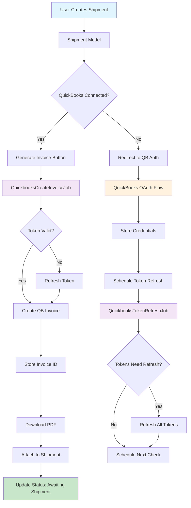
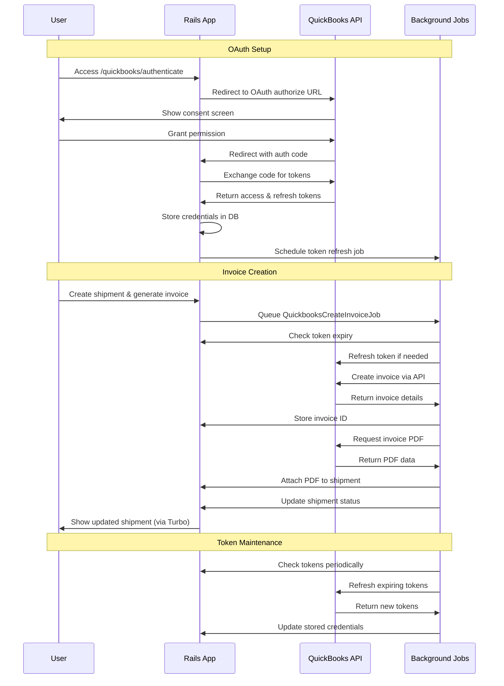

# QuickBooks API Integration Demo

A Rails 8 application demonstrating seamless integration with the QuickBooks API for automated invoice generation from shipment data. This demo showcases OAuth 2.0 authentication, token management, and automated document processing workflows.

## 🚀 Features

- **QuickBooks OAuth 2.0 Integration**: Secure authentication and authorization
- **Automated Token Management**: Background refresh of access tokens
- **Invoice Generation**: Create QuickBooks invoices from shipment data
- **PDF Document Handling**: Automatic retrieval and storage of invoice PDFs
- **Shipment Tracking**: Complete workflow from pending to shipped status
- **Real-time Updates**: Live status updates using Turbo broadcasts
- **Background Processing**: Reliable job processing with Solid Queue

## 🏗️ Architecture Overview



## 🔄 QuickBooks API Integration Flow



## 📁 Project Structure

```
app/
├── controllers/
│   ├── quickbooks_controller.rb      # OAuth authentication flow
│   ├── shipments_controller.rb       # Shipment CRUD operations
│   └── pages_controller.rb           # Home page
├── models/
│   ├── quickbooks_credential.rb      # OAuth token management
│   ├── shipment.rb                   # Shipment with invoice tracking
│   └── shipment_item.rb              # Individual items in shipments
├── jobs/
│   ├── quickbooks_create_invoice_job.rb    # Invoice generation
│   └── quickbooks_token_refresh_job.rb     # Token maintenance
└── views/
    ├── shipments/                    # Shipment management UI
    └── pages/                        # Home page with QB connection
```

## 🛠️ Setup Instructions

### Prerequisites

- Ruby 3.2+
- Rails 8.0+
- QuickBooks Developer Account
- Intuit Developer App (sandbox or production)

### 1. Clone and Install

```bash
git clone https://github.com/yourusername/quickbooks-demo.git
cd quickbooks-demo
bundle install
```

### 2. Database Setup

```bash
bin/rails db:create db:migrate
```

### 3. Environment Configuration

Create a `.env` file in the project root:

```env
# QuickBooks App Credentials (from Intuit Developer Dashboard)
INTUIT_CLIENT_ID=your_app_client_id
INTUIT_CLIENT_SECRET=your_app_client_secret

# Rails Configuration
RAILS_ENV=development
SECRET_KEY_BASE=your_secret_key_base
```

### 4. QuickBooks App Configuration

In your Intuit Developer Dashboard:

1. Create a new QuickBooks app
2. Set the redirect URI to: `http://localhost:3000/quickbooks/oauth_callback`
3. Copy the Client ID and Client Secret to your `.env` file
4. Enable sandbox mode for testing

### 5. Start Development Server

```bash
bin/dev
```

This starts:
- Rails server on port 3000
- Tailwind CSS watcher
- Solid Queue background jobs

## 🎯 Usage

### 1. Connect QuickBooks

1. Visit `http://localhost:3000`
2. Click "Connect QuickBooks"
3. Sign in to your QuickBooks sandbox/company
4. Grant permissions to the app

### 2. Create and Process Shipments

1. Click "New Shipment"
2. Fill in shipment details and add items
3. Save the shipment
4. Click "Generate Invoice" to create a QuickBooks invoice
5. Watch the status update in real-time
6. Download the generated invoice PDF

### 3. Monitor Background Processing

- Check Rails logs for job processing: `tail -f log/development.log`
- View job queue status in the Rails console
- Token refresh happens automatically in the background

## 🔧 Key Components

### QuickbooksCredential Model

Central hub for OAuth token management:

```ruby
# Token refresh check
credential.needs_refresh?  # => true/false

# Manual token refresh  
credential.refresh_token!

# Get OAuth2 access token for API calls
credential.oauth_access_token
```

### Background Jobs

**QuickbooksCreateInvoiceJob**: Handles the complete invoice creation workflow
- Validates shipment and credentials
- Refreshes tokens if needed
- Creates invoice via QuickBooks API
- Downloads and attaches PDF
- Updates shipment status

**QuickbooksTokenRefreshJob**: Maintains token freshness
- Checks all stored credentials
- Refreshes tokens expiring within 10 minutes
- Reschedules itself dynamically

### Shipment Status Flow

1. `pending` → Initial state
2. `generating_invoice` → Creating QuickBooks invoice
3. `downloading_packslip` → Retrieving invoice PDF
4. `awaiting_shipment` → Ready for physical shipment
5. `shipped` → Package dispatched
6. `delivered` → Package received

## 🧪 Testing

```bash
# Run all tests (excludes system tests)
bin/rails test

# Run with database reset
bin/rails test:db

# Run linter
bin/rubocop
```

The test suite includes:
- VCR cassettes for QuickBooks API responses
- WebMock for HTTP request mocking
- Minitest for unit and integration tests

## 🚦 API Rate Limits & Best Practices

- QuickBooks Sandbox: 100 requests per minute
- Production: 500 requests per minute per app
- Token refresh is automatic and proactive
- Failed jobs retry up to 3 times with exponential backoff
- PDF retrieval is separate from invoice creation for resilience

## 🔐 Security Considerations

- Access tokens are encrypted at rest
- Refresh tokens are filtered from logs
- OAuth state parameter prevents CSRF attacks
- Sandbox mode enabled in non-production environments
- Token expiry is checked before every API call

## 📚 QuickBooks API Resources

- [QuickBooks API Documentation](https://developer.intuit.com/app/developer/qbo/docs/api/accounting/all-entities/invoice)
- [OAuth 2.0 Guide](https://developer.intuit.com/app/developer/qbo/docs/develop/authentication-and-authorization/oauth-2.0)
- [Sandbox Testing](https://developer.intuit.com/app/developer/qbo/docs/develop/sandboxing)

## 🤝 Contributing

1. Fork the repository
2. Create a feature branch
3. Make your changes
4. Add tests for new functionality
5. Run the test suite
6. Submit a pull request

## 📄 License

This project is licensed under the MIT License - see the [LICENSE.md](LICENSE.md) file for details.

---

**Note**: This is a demonstration application. For production use, ensure proper error handling, logging, monitoring, and security measures are in place.
