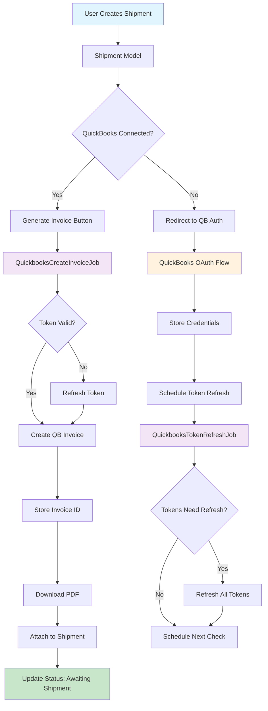
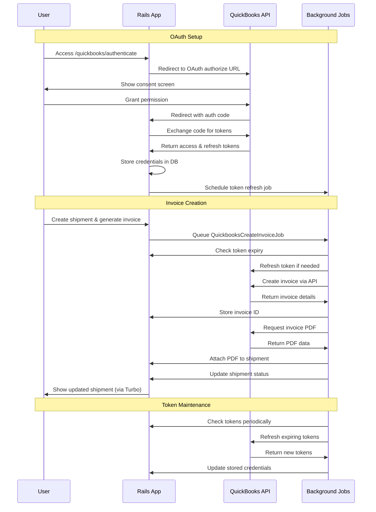

# QuickBooks Demo (Rails 8)

A small Rails app that connects to QuickBooks, creates an Invoice from a Shipment, downloads the invoice PDF, and updates the UI in real time.

## What it does

* Connects a QuickBooks company via OAuth 2.0
* Creates an Invoice from a `Shipment` and its `ShipmentItem`s
* Downloads and attaches the invoice PDF to the Shipment
* Maintains tokens and updates shipment status as background jobs run

## Architecture Overview



## QuickBooks API Integration Flow



## Tech stack

Rails 8 · Turbo · Solid Queue · Tailwind · Minitest · VCR/WebMock

## Project structure

```
app/
├── controllers/
│   ├── quickbooks_controller.rb      # OAuth flow
│   ├── shipments_controller.rb       # Shipment CRUD
│   └── pages_controller.rb           # Home page
├── models/
│   ├── quickbooks_credential.rb      # OAuth token management
│   ├── shipment.rb                   # Shipment with invoice tracking
│   └── shipment_item.rb              # Shipment line items
├── jobs/
│   ├── quickbooks_create_invoice_job.rb    # Invoice generation
│   └── quickbooks_token_refresh_job.rb     # Token maintenance
└── views/
    ├── shipments/                    # Shipment UI
    └── pages/                        # Home/QB connection
```

## Quick start

```bash
# 1) Install deps
bundle install

# 2) DB
bin/rails db:setup

# 3) Env vars
cp .env.sample .env
# Fill in your Intuit client ID/secret, etc.

# 4) Run the app
bin/dev
# Rails on http://localhost:3000
```

### Configure your Intuit app

* Create an app in the Intuit Developer Dashboard
* Add redirect URI: `http://localhost:3000/quickbooks/oauth_callback`
* Copy the Client ID/Secret into `.env`
* Use a sandbox company for testing

## Usage

### 1) Connect QuickBooks

1. Visit `http://localhost:3000`
2. Click **Connect QuickBooks**
3. Authorize the sandbox company

### 2) Create and process shipments

1. New Shipment → add items
2. Click **Generate Invoice**
3. Watch status updates in real time and download the invoice PDF

### 3) Monitor background work

* Tail logs: `tail -f log/development.log`
* Jobs run via Solid Queue; token refresh is scheduled automatically

## Shipment statuses

1. `pending` – initial state
2. `generating_invoice` – creating QuickBooks invoice
3. `downloading_packslip` – retrieving invoice PDF (name reflects “packing slip”)
4. `awaiting_shipment` – ready to ship
5. `shipped` – dispatched
6. `delivered` – received

## Development notes

* **Idempotency.** Ensure invoice creation can be retried without duplicates (e.g., use an external ID/request key when you extend this).
* **Rate limits.** QuickBooks enforces per-realm throttles; handle HTTP 429 with backoff and respect concurrency limits. See the official docs for current values.
  Docs: [https://developer.intuit.com/app/developer/qbo/docs/learn/rest-api-features](https://developer.intuit.com/app/developer/qbo/docs/learn/rest-api-features)
* **Security.** Encrypt tokens at rest, filter secrets from logs, and validate OAuth `state`.

## Testing

```bash
# Unit/integration tests
bin/rails test

# Lint
bin/rubocop
```

Tests use VCR/WebMock to record and stub QuickBooks responses.

## Troubleshooting

* **401/403** – expired tokens or scope mismatch → re-connect QuickBooks
* **429** – throttled → exponential backoff; keep requests single-threaded per realm
* **Invalid reference** – missing Customer/Item in the sandbox → seed or create first

## License

MIT. See `LICENSE.md`.
